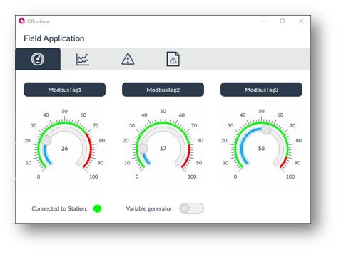
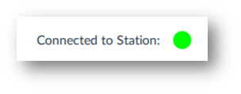
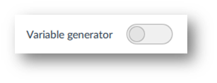

# Demo MQTT Field Application
## Introduction
Demo MQTT is an example consisting of two projects: Field Application and Data Aggregator Application. The objective of this demo is to simply show an example of communication via MQTT protocol between a hypothetical application running on a machine/plant (Field Application) and an application that collects the data sent by the machine, showing them in the form of a dashboard (Data Aggregator Application). Usually, it would be done only with the visualization of historical data (cold data) but in this project, we also wanted to show an example of receiving live data.

## How to start the project
To start this application, you just need:
1. Optix (version 1.0.1.24 or higher)
2. Internet connection
3. Modbus simulator

## Required NuGet packages:
1. MQTTnet V3.1.2 by "The contributors of MQTTnet" [GitHub](https://github.com/dotnet/MQTTnet)
2. MQTTnet.Extensions.ManagedClient V3.1.2 by "The contributors of MQTTnet" [GitHub](https://github.com/dotnet/MQTTnet)
3. Newtonsoft.Json V13.0.1 by "James Newton-King" [Link](by "The contributors of MQTTnet" [GitHub](https://github.com/dotnet/MQTTnet)
4. M2MQTT V4.3.0 by Paolo Patierno [Link](http://uplibrary.codeplex.com/)

## Remember
Once the libraries are installed from NuGet, import them in your project by following these steps:
1. Open the NetLogic
2. Click on the project’s .csproj file
3. Modify it by adding `<CopyLocalLockFileAssemblies>true</CopyLocalLockFileAssemblies>` after `<AppendTargetFrameworkToOutputPath>false</AppendTargetFrameworkToOutputPath>`
4. Build the project

# Important information
The example is provided as-is and can be a useful reference for building your application. The example as it is cannot be used on a real machine but must be adapted for the purpose, respecting the highest safety standards required.
A public and open source MQTT broker is used in the project for demonstration purposes only, it is not secured, and its uptime can’t be guaranteed. We strongly encourage you to change the topic and server names using your provider before deploying the final application.

This application simulates the connection to a real machine/plant via a Modbus driver. 

### STEP 1

To be able to use the demo, please choose a Modbus simulator and configure it properly (IP Address, Port) to view the variables exchanged between Field Application and Data Aggregator Application. 
Tags register number (Holding register memory area): 1, 2, 3.

### STEP 2

After that, you can run your application with FT Optix Emulator.
 
### STEP 3

If the connection with the Modbus Simulator is working, the “Connected to Station” LED will be green.
 
### STEP 4

Once the application has started and the Modbus Simulator connection is ON, you can easily simulate the Modbus Station tags with the "variable generator" switch. This switch is connected to the Runtime Netlogic “VariableGenerator” (see Netlogic folder) that generates random values.
 
### STEP 5

Browse through the pages to see: 
1. Live data 
2. Trends 
3. Live alarms 
4. Historical alarms

## Disclaimer

Rockwell Automation maintains these repositories as a convenience to you and other users. Although Rockwell Automation reserves the right at any time and for any reason to refuse access to edit or remove content from this Repository, you acknowledge and agree to accept sole responsibility and liability for any Repository content posted, transmitted, downloaded, or used by you. Rockwell Automation has no obligation to monitor or update Repository content

The examples provided are to be used as a reference for building your own application and should not be used in production as-is. It is recommended to adapt the example for the purpose, observing the highest safety standards.
